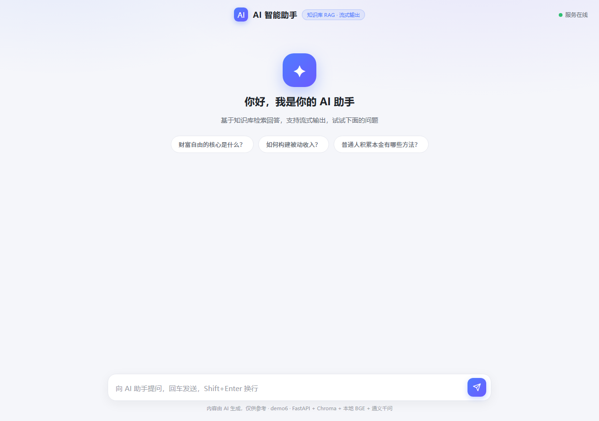
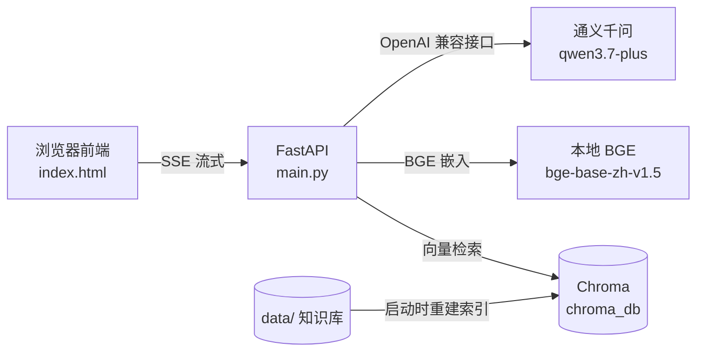

# demo6 · AI 智能对话（RAG 检索 + 流式输出）

> 基于知识库检索增强生成（RAG）的流式智能问答，豆包风格单页前端，支持 SSE 打字机效果与来源引用展开。

   

## 🚀 在线体验

**http://118.178.56.172:8000**

> 服务已部署在阿里云轻量服务器（Docker 容器，自启动），公网可直接访问。回答来自通义千问大模型 + 本地知识库检索，支持流式打字机输出与来源引用展开。



## 功能特性

- 🧠 **RAG 检索问答**：启动时扫描 `data/` 目录（txt/md/docx）→ 本地 BGE 向量化 → Chroma 持久化索引
- ⚡ **SSE 流式输出**：回答逐字渲染，浏览器端 `fetch` + `ReadableStream` 解析
- 📄 **来源引用**：回答附带检索到的知识来源，点击可展开原文
- ✍️ **离线优先**：嵌入用本地 BGE 模型，不依赖外部向量服务；回答模型走通义千问
- 🛑 **停止生成**：前端 AbortController 支持随时中断

## 使用说明

### 交互流程

1. 在输入框提问（**Enter** 发送，**Shift+Enter** 换行）
2. 点击发送，AI 开始**逐字流式输出**回答（打字机效果）
3. 回答上方出现「📄 参考 N 篇文档」，点击可展开/收起检索来源原文
4. 生成过程中按钮变为红色**停止**，可随时中断

### 推荐测试问题

知识库默认收录了关于「财富自由」的文档，用这些问题能立刻体验 RAG 效果：

| 问题 | 体验点 |
|---|---|
| 财富自由的核心是什么？ | 基础问答 + 来源引用 |
| 如何构建被动收入？ | 检索多篇文档内容 |
| 普通人积累本金有哪些方法？ | 长回答 + 流式打字机 |

### 界面示意

```
┌─────────────────────────────────────────────────┐
│  💬 AI 智能助手                        ● 服务在线 │
│                                                 │
│  我  财富自由的核心是什么？                      │
│  AI  📄 参考 3 篇文档 ▸                          │
│      ▍真正的财富自由，从来不是坐拥无尽财富…      │
│                                                 │
│  [ 输入问题，回车发送..........................] │
│                         [➤ 发送]  [⏹ 停止]      │
└─────────────────────────────────────────────────┘
```

### 直接调接口体验（curl）

```bash
curl -sN -X POST http://localhost:8000/api/chat \
  -H "Content-Type: application/json" \
  -d '{"query":"财富自由的核心是什么？","top_k":3}'
```

依次收到 SSE 事件流：

```
event: source   # 检索来源（前端展示引用）
event: token    # 回答增量（逐字渲染，可能多条）
event: done     # 回答结束
```

## 架构



## 技术栈

| 层 | 选型 |
|---|---|
| Web 框架 | FastAPI + Uvicorn |
| 向量库 | Chroma（持久化，无需外部服务） |
| 嵌入模型 | BGE-base-zh-v1.5（本地 / HuggingFace Hub） |
| 回答模型 | 通义千问 qwen3.7-plus（DashScope OpenAI 兼容接口） |
| 前端 | 原生 HTML + fetch SSE（无框架） |

## 快速开始（本地运行）

```bash
cd demo6

# 1. 创建虚拟环境（Python 3.10）
python -m venv .venv
.venv/Scripts/activate          # Windows
# source .venv/bin/activate     # Linux/macOS

# 2. 安装依赖
pip install -r requirements.txt

# 3. 配置通义千问 API Key（环境变量）
# Windows:  set DASHSCOPE_API_KEY=sk-xxxx
# Linux:    export DASHSCOPE_API_KEY=sk-xxxx

# 4. 启动
uvicorn main:app --host 0.0.0.0 --port 8000

# 5. 打开浏览器
# http://localhost:8000
```

> **关于 BGE 模型**：本机已存在本地模型时直接使用；否则自动从 HuggingFace Hub 下载 `BAAI/bge-base-zh-v1.5`（首次联网下载约 400MB）。Docker 构建时模型由部署方用 ModelScope 预下载（`snapshot_download('AI-ModelScope/bge-base-zh-v1.5', local_dir=bge-model)`，国内实测 ~190MB/s），`COPY . .` 带入镜像，运行时通过 `BGE_MODEL_PATH=/app/bge-model` 本地加载，不依赖构建期联网。

## 部署到国内云服务器（阿里云示例）

本项目内置 `Dockerfile`，适配国内网络环境（清华 pip 源 / 上交大 torch 镜像 / ModelScope 模型），可部署到任意云服务器：

1. 准备服务器：装好 Docker，上传 `demo6/` 目录
2. 预下载 BGE 模型到构建上下文：
   ```bash
   pip install modelscope -i https://pypi.tuna.tsinghua.edu.cn/simple
   python -c "from modelscope import snapshot_download; snapshot_download('AI-ModelScope/bge-base-zh-v1.5', local_dir='bge-model')"
   ```
3. 构建并启动（需配置 `DASHSCOPE_API_KEY`）：
   ```bash
   docker build -t demo6-rag .
   docker run -d --name demo6-rag --restart unless-stopped \
     -p 8000:8000 -e DASHSCOPE_API_KEY=sk-xxx demo6-rag
   ```
4. 云控制台防火墙放行 8000 端口，访问 `http://<服务器IP>:8000`

> ⚠️ 构建 tip：torch 使用上交大镜像 `https://mirror.sjtu.edu.cn/pytorch-wheels/cpu` 的 CPU wheel 直接下载安装；阿里云 pytorch 镜像已失效（返回无关 HTML），download.pytorch.org 国内仅 184KB/s 不推荐。

## 项目结构

```
demo6/
├── main.py            # FastAPI 后端：RAG 检索 + SSE 流式接口 + 索引构建
├── index.html         # 豆包风格单页前端（fetch + ReadableStream 解析 SSE）
├── data/              # 知识库文档（txt/md/docx），启动时自动重建索引
├── chroma_db/         # Chroma 持久化索引（由 data/ 重建，勿提交）
├── requirements.txt   # 依赖锁定
├── Dockerfile         # HF Spaces 部署镜像
└── TESTING.md         # 联调测试记录
```

## API 说明

| 方法 | 路径 | 说明 |
|---|---|---|
| POST | `/api/chat` | RAG 流式问答，SSE 事件：`source` / `token` / `done` / `error` |
| GET | `/api/health` | 健康检查 |
| GET | `/` | 前端页面 |
| GET | `/docs` | Swagger 接口文档 |

`POST /api/chat` 请求示例：

```json
{
  "query": "财富自由的核心是什么？",
  "top_k": 3,
  "history": [{"role": "user", "content": "..."}]
}
```

## 说明

- `REBUILD_ON_START = True`：每次启动重建索引，保证 **索引 == data 目录**；新增知识后重启即可
- 未配置 `DASHSCOPE_API_KEY` 时，接口退化为直接返回检索原文，方便离线调试
- 回答模型可用环境变量 `QWEN_MODEL` 覆盖（默认 `qwen3.7-plus`）

## License

MIT
